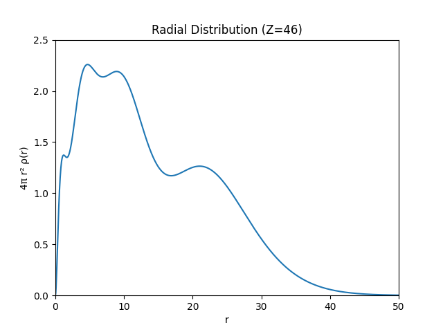

# Hydrogen_Atoms_Solver

Numerical solution of the radial Schrödinger equation for the hydrogen atom.

## Features
- Shooting method
- Numerov method
- Bound state finder
- Charge density approximation

## Example Output

### Radial Probability Density (n=4)



## Requirements
See requirements.txt

## Run example
```bash
python examples/run_example.py
```
